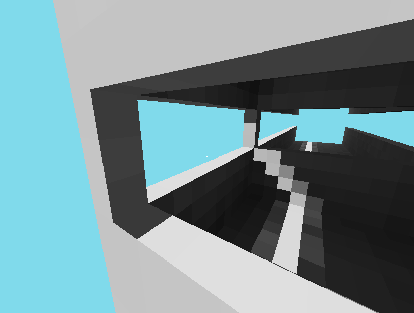

# frustra
A voxel renderer in Vulkan ([vulkano](https://github.com/vulkano-rs/vulkano)) with raytraced lighting. Just for fun.

More work is needed before it could be used for a game. The most important things are (a) chunks and (b) more efficient buffer updates. Neither are too hard but I've moved on to other projects. Also, the raytracing could easily be done in a compute shader for more performance.

Here's a screenshot:

